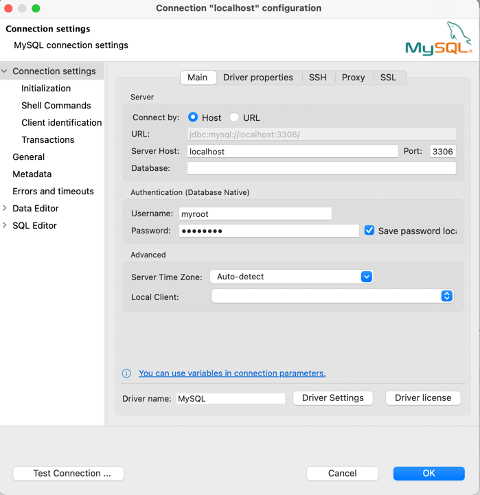
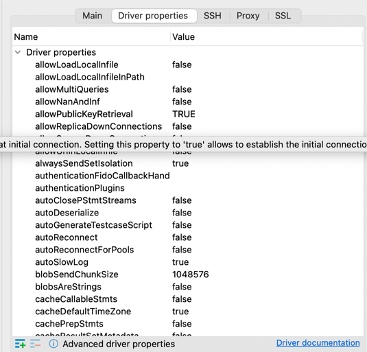

# Run a containerised MySQL server locally and connect with a DB tool

## Pull the MySQL Docker image:
`docker pull mysql/mysql-server:latest`
## Run the MySQL Docker container:
`docker run --name=your-mysql-container-name -d -p 3306:3306 -e MYSQL_ROOT_PASSWORD=your-sql-password mysql/mysql-server:latest`

- The -d flag tells Docker to run the container in detached mode.
- The -p 3306:3306 flag maps the port 3306 on the Docker host to port 3306 on the container. This is the default port for MySQL.
- The -e MYSQL_ROOT_PASSWORD=your-sql-password flag sets the root password for the MySQL database.

## Connect to the MySQL container:
`docker exec -it your-mysql-container-name mysql -u root -p`

- The -it flag tells Docker to open an interactive terminal in the container.
- The mysql command starts the MySQL client.
- The -u root flag specifies the username to use.
- The -p flag prompts for the password.

## Create a user for your DB tool:
`mysql> CREATE USER 'myroot'@'%' IDENTIFIED BY 'db-tool-password';`

`mysql> FLUSH PRIVILEGES;`

- The CREATE USER statement creates a new user named myroot. The @ symbol specifies that the user can connect from any host.
- The IDENTIFIED BY clause specifies the password for the user.
- The FLUSH PRIVILEGES statement updates the privileges for all users.

## Grant privileges to the user:
`mysql> GRANT ALL PRIVILEGES ON *.* TO 'myroot'@'%' WITH GRANT OPTION;`

- The GRANT ALL PRIVILEGES statement grants all privileges to the user.
- The ON *.* clause specifies that the privileges apply to all databases and tables.
- The WITH GRANT OPTION clause allows the user to grant privileges to other users.

## Connect to the MySQL server with your DB tool(I've used DBeaver):

- In your DB Tool, make sure to set the `allowPublicKeyRetrieval` parameter to True.
- This parameter allows the DB Tool to retrieve the public key from the MySQL server.

